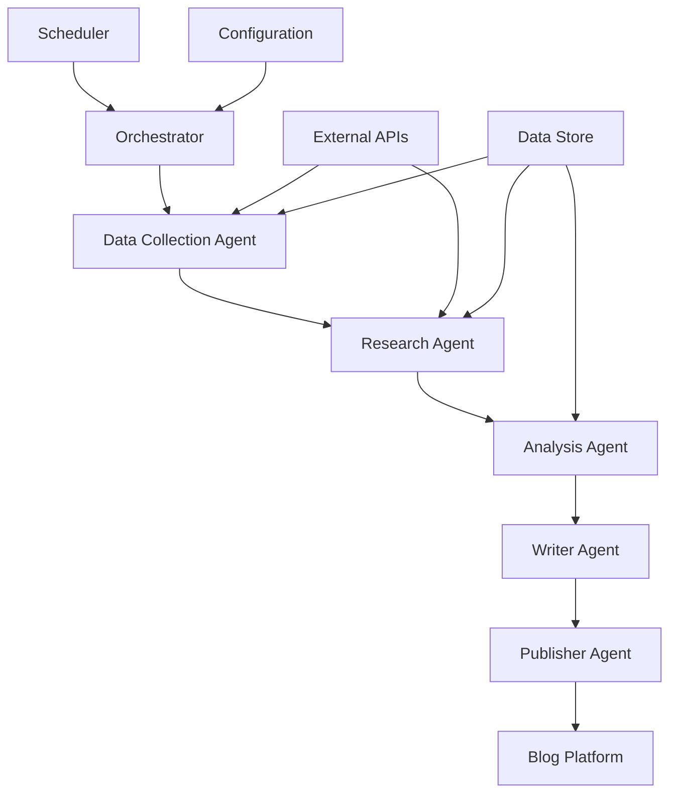
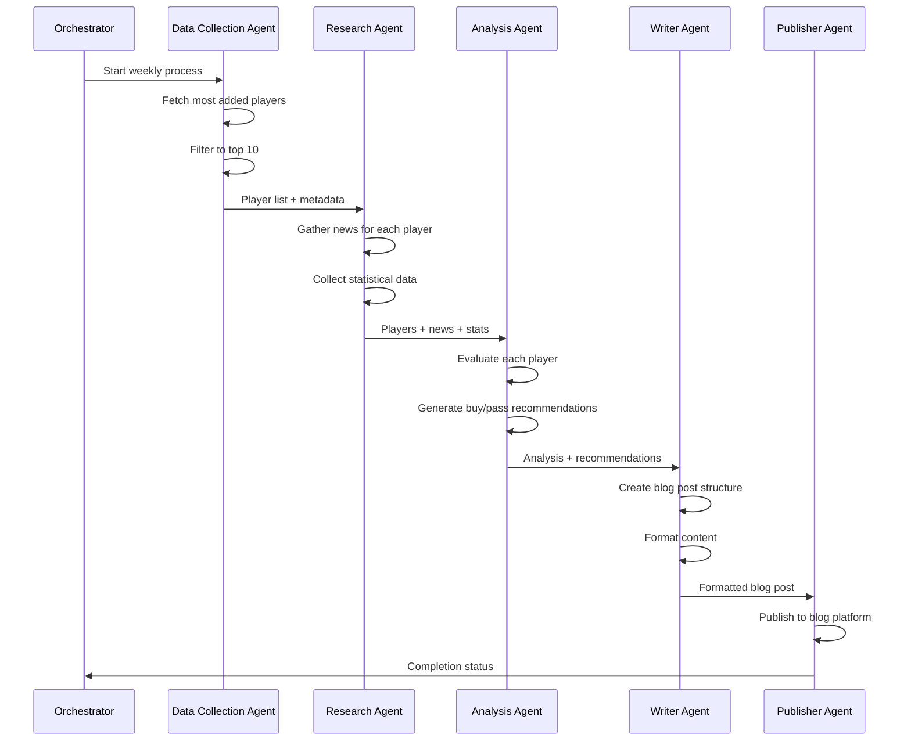

# Design Document

## Overview

The Fantasy Football FAAB Blog System is a multi-agent orchestration platform that automates the creation of weekly fantasy football content. The system employs a pipeline architecture where specialized AI agents work sequentially to gather data, perform analysis, and publish content. Each agent has a specific domain expertise and contributes to the final blog post through a well-defined interface.

The system integrates with multiple external APIs including fantasy football platforms (ESPN, Yahoo, Sleeper), sports news services (ESPN API, The Athletic), and statistical databases to provide comprehensive analysis. The final output is automatically published to a blog platform with proper formatting and metadata.

## Architecture

### High-Level Architecture



### Agent Communication Pattern

The system uses a message-passing architecture where each agent:
1. Receives structured input from the previous agent
2. Performs its specialized task
3. Outputs structured data for the next agent
4. Logs its activities for monitoring and debugging

### Data Flow



## Components and Interfaces

### 1. Orchestrator Service

**Responsibilities:**
- Manages the overall workflow execution
- Handles error recovery and retry logic
- Coordinates agent communication
- Manages scheduling and triggers

**Interface:**
```typescript
interface OrchestratorService {
  executeWeeklyProcess(): Promise<ExecutionResult>
  handleAgentFailure(agent: string, error: Error): Promise<void>
  getExecutionStatus(): ExecutionStatus
}
```

### 2. Data Collection Agent

**Responsibilities:**
- Integrates with fantasy football platforms (ESPN, Yahoo, Sleeper)
- Retrieves most added players data
- Filters and ranks players by addition frequency
- Handles API rate limiting and caching

**Interface:**
```typescript
interface DataCollectionAgent {
  getMostAddedPlayers(): Promise<PlayerAdditionData[]>
  filterToTopTen(players: PlayerAdditionData[]): PlayerSummary[]
}

interface PlayerSummary {
  playerId: string
  name: string
  position: string
  team: string
  additionCount: number
  additionPercentage: number
  platforms: string[]
}
```

### 3. Research Agent

**Responsibilities:**
- Gathers recent news articles for each player
- Collects statistical performance data
- Retrieves injury reports and status updates
- Analyzes matchup information

**Interface:**
```typescript
interface ResearchAgent {
  gatherPlayerResearch(players: PlayerSummary[]): Promise<PlayerResearch[]>
}

interface PlayerResearch {
  player: PlayerSummary
  news: NewsArticle[]
  stats: PlayerStats
  injuryStatus: InjuryReport
  upcomingMatchups: Matchup[]
  recentPerformance: PerformanceMetrics
}
```

### 4. Analysis Agent

**Responsibilities:**
- Evaluates each player's fantasy value
- Considers FAAB budget allocation strategies
- Generates buy/pass recommendations with reasoning
- Assesses short-term vs long-term value

**Interface:**
```typescript
interface AnalysisAgent {
  analyzePlayer(research: PlayerResearch): Promise<PlayerAnalysis>
}

interface PlayerAnalysis {
  player: PlayerSummary
  recommendation: 'BUY' | 'PASS'
  confidence: number
  reasoning: string[]
  suggestedFAABPercentage?: number
  riskFactors: string[]
  upside: string[]
}
```

### 5. Writer Agent

**Responsibilities:**
- Compiles all analysis into a cohesive blog post
- Formats content for web publication
- Creates engaging headlines and summaries
- Ensures consistent tone and style

**Interface:**
```typescript
interface WriterAgent {
  createBlogPost(analyses: PlayerAnalysis[]): Promise<BlogPost>
}

interface BlogPost {
  title: string
  summary: string
  content: string
  metadata: BlogMetadata
  publishDate: Date
}
```

### 6. Publisher Agent

**Responsibilities:**
- Publishes content to the blog platform
- Handles authentication and API integration
- Manages post metadata and categorization
- Provides publication confirmation

**Interface:**
```typescript
interface PublisherAgent {
  publishPost(post: BlogPost): Promise<PublicationResult>
}
```

## Data Models

### Core Data Structures

```typescript
// Player identification and basic info
interface Player {
  id: string
  name: string
  position: 'QB' | 'RB' | 'WR' | 'TE' | 'K' | 'DST'
  team: string
  jerseyNumber?: number
}

// Statistical performance data
interface PlayerStats {
  season: number
  week: number
  fantasyPoints: number
  projectedPoints: number
  usage: {
    snapCount?: number
    targets?: number
    carries?: number
    redZoneTargets?: number
  }
  efficiency: {
    yardsPerTarget?: number
    yardsPerCarry?: number
    touchdownRate?: number
  }
}

// News and information
interface NewsArticle {
  title: string
  source: string
  publishDate: Date
  summary: string
  url: string
  sentiment: 'positive' | 'neutral' | 'negative'
}

// Injury tracking
interface InjuryReport {
  status: 'healthy' | 'questionable' | 'doubtful' | 'out' | 'ir'
  description?: string
  expectedReturn?: Date
  impactLevel: 'low' | 'medium' | 'high'
}
```

### Configuration Models

```typescript
interface SystemConfig {
  schedule: {
    dayOfWeek: number // 0-6, Sunday = 0
    hour: number // 0-23
    timezone: string
  }
  apis: {
    fantasyPlatforms: PlatformConfig[]
    newsServices: NewsServiceConfig[]
    sportsData: SportsDataConfig
  }
  blog: BlogPlatformConfig
  agents: AgentConfig[]
}
```

## Error Handling

### Error Categories

1. **API Failures**: External service unavailability or rate limiting
2. **Data Quality Issues**: Missing or invalid player data
3. **Agent Failures**: Individual agent processing errors
4. **Publishing Errors**: Blog platform integration issues

### Error Recovery Strategies

```typescript
interface ErrorHandler {
  handleAPIFailure(service: string, error: Error): Promise<void>
  handleDataQualityIssue(issue: DataQualityIssue): Promise<void>
  handleAgentFailure(agent: string, error: Error): Promise<void>
}
```

**Recovery Mechanisms:**
- **Retry Logic**: Exponential backoff for transient failures
- **Fallback Data**: Use cached or alternative data sources
- **Graceful Degradation**: Continue with partial data when possible
- **Manual Intervention**: Alert administrators for critical failures

### Monitoring and Alerting

- Real-time execution monitoring
- Performance metrics tracking
- Error rate monitoring
- Data quality validation
- Publication success tracking

## Testing Strategy

### Unit Testing
- Individual agent functionality testing
- Data model validation
- API integration mocking
- Error handling verification

### Integration Testing
- End-to-end workflow testing
- External API integration testing
- Database operations testing
- Agent communication testing

### Performance Testing
- API response time monitoring
- Memory usage optimization
- Concurrent execution testing
- Load testing for high-traffic periods

### Content Quality Testing
- Generated content review processes
- Fact-checking automation
- Style and tone consistency validation
- SEO optimization verification

### Deployment Testing
- Staging environment validation
- Production deployment verification
- Rollback procedure testing
- Configuration management testing